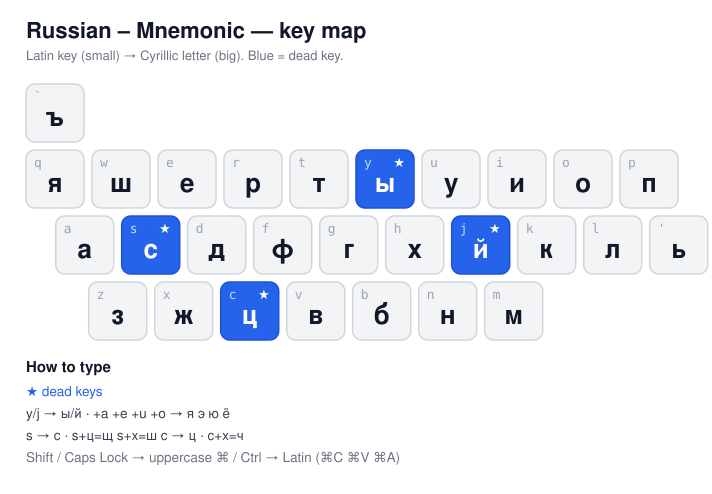

# Russian – Mnemonic keyboard layout for macOS

A **native macOS keyboard layout** that reproduces the Windows
*"Russian - Mnemonic"* layout (`kbdrum.dll`) **1:1**, including its dead keys.
If you're used to the phonetic Russian layout on Windows (`a→а`, `b→б`, `v→в`,
`y→ы`, `s→с` …) and miss it on your Mac — this brings it back, as a first-class
input source. No background apps, no hacks.

*(Русское описание — ниже / Russian description below.)*

[](LICENSE)
· macOS · works on macOS 26 (Tahoe)



---

## Features

- ✅ **1:1 with Windows** — generated from the official `kbdrum.dll` mapping.
- ✅ **Dead keys** — `y→ы`, `j→й`, `s→с`, `c→ц` with phonetic combos (`y+a=я`, `s+ц=щ`, `c+х=ч`).
- ✅ **Native** — installs as a normal Input Source; appears under **Russian**.
- ✅ **Voice typing / Dictation** follows the layout (tagged as `ru`).
- ✅ **Backspace, arrows, Tab, etc.** work everywhere — incl. Electron/Chromium apps (Telegram, WhatsApp, Slack, VS Code).
- ✅ **⌘ shortcuts** (`⌘C`, `⌘V`, `⌘A`, `⌘Z` …) work, via a Latin Command layer.

## Install

```bash
git clone https://github.com/crcknaka/mac-russian-mnemonic.git
cd mac-russian-mnemonic
./install.sh --bundle      # installs the language-tagged bundle (recommended)
```

Then:

1. **Log out and back in** (or reboot) — macOS only reloads layouts at login.
2. **System Settings → Keyboard → Text Input → Input Sources → Edit… → `+`**
   → find **Russian – Mnemonic** (under *Russian*) → **Add**.
3. Switch input sources with `Ctrl+Space`.
4. *(Optional, for voice typing)* **Keyboard → Dictation → Languages → enable Russian.**

> Prefer not to run a script? Copy `Russian Mnemonic.bundle` into
> `~/Library/Keyboard Layouts/` yourself, then log out/in.

## Key map

Direct keys (the letter appears immediately):

```
q→я  w→ш  e→е  r→р  t→т  u→у  i→и  o→о  p→п
a→а  d→д  f→ф  g→г  h→х  k→к  l→л
z→з  x→ж  v→в  b→б  n→н  m→м
'→ь   `→ъ
```

Dead keys (press the prefix, then the second key):

| Prefix | + space | + a | + e | + u | + o | + х | + ц |
|--------|---------|-----|-----|-----|-----|-----|-----|
| `y`    | ы       | я   | э   | ю   | ё   |     |     |
| `j`    | й       | я   | э   | ю   | ё   |     |     |
| `s`    | с       |     |     |     |     | ш   | щ   |
| `c`    | ц       |     |     |     | ч (`c`+х) | | |

Examples: `s c` → щ, `c h` → ч, `y o` → ё, `j space` → й.
Uppercase and Caps Lock behave the same. A dead-key prefix auto-resolves before
a normal consonant: `м y л о` → "мыло".

## Build from source

The layout is generated from a small data model — edit the dicts, regenerate:

```bash
python3 generate_keylayout.py    # -> "Russian – Mnemonic.keylayout"
./build_bundle.sh                # -> "Russian Mnemonic.bundle"
./install.sh --bundle            # regenerate + build + install
```

- [`generate_keylayout.py`](generate_keylayout.py) — emits the `.keylayout` (key map, dead keys, system keys, Latin ⌘ layer).
- [`build_bundle.sh`](build_bundle.sh) — wraps it into a language-tagged `.bundle`.
- [`install.sh`](install.sh) — `--bundle` for the bundle, no arg for a bare `.keylayout`.
- [`reference/`](reference/) — the original Windows layout dump (source of truth).

## How it works (technical notes)

A few non-obvious things that make it behave like a real layout:

- **Dictation language** — only a *bundle* can carry `TISIntendedLanguage`
  (`ru`), and its `CFBundleIdentifier` **must** contain `.keyboardlayout.`.
  A bare `.keylayout` lands in the "Others" group with no language, and
  Dictation won't follow it.
- **Backspace in Electron apps** — the layout must define the non-printing keys
  (Backspace `&#x0008;`, Tab, Return, Esc, arrows…) like Apple's own layouts do,
  or Chromium-based apps won't generate the key events.
- **⌘ shortcuts** — a 4th key map (US-QWERTY) is selected when Command/Control
  is held, so `⌘C/⌘V/⌘A` resolve to Latin letters and match menu shortcuts.

## Credits

The key mapping reproduces Microsoft's *"Russian - Mnemonic"* layout, dumped
from `kbdrum.dll` via **[kbdlayout.info](https://kbdlayout.info/kbdrum/)**.
The original layout is © Microsoft Corporation; see [`reference/`](reference/).
Bundle structure informed by Apple's own layouts and
[kirelagin/macos-keyboard-layout](https://github.com/kirelagin/macos-keyboard-layout).

## License

[MIT](LICENSE) © 2026 crcknaka — for the code in this repo (generator, scripts,
the generated macOS layout).

---

# Русская мнемоническая раскладка для macOS

**Нативная раскладка для macOS**, которая повторяет **1-в-1** виндовую раскладку
*«Russian - Mnemonic»* (`kbdrum.dll`), вместе с мёртвыми клавишами. Если ты
привык к фонетической русской раскладке на Windows (`a→а`, `b→б`, `v→в`, `y→ы`,
`s→с` …) и тебе её не хватает на Маке — это возвращает её как полноценный
источник ввода. Без фоновых программ и костылей.

## Возможности

- ✅ **1-в-1 с Windows** — сгенерировано из официального дампа `kbdrum.dll`.
- ✅ **Мёртвые клавиши** — `y→ы`, `j→й`, `s→с`, `c→ц` с комбинациями (`y+a=я`, `s+ц=щ`, `c+х=ч`).
- ✅ **Нативность** — обычный источник ввода, в разделе **Russian**.
- ✅ **Голосовой набор (Диктовка)** следует за раскладкой (помечена как `ru`).
- ✅ **Backspace, стрелки, Tab и т.д.** работают везде — включая Electron/Chromium (Telegram, WhatsApp, Slack, VS Code).
- ✅ **Шорткаты ⌘** (`⌘C`, `⌘V`, `⌘A`, `⌘Z` …) работают — через латинский Command-слой.

## Установка

```bash
git clone https://github.com/crcknaka/mac-russian-mnemonic.git
cd mac-russian-mnemonic
./install.sh --bundle      # ставит bundle с меткой языка (рекомендуется)
```

Затем:

1. **Выйти из системы и зайти заново** (или перезагрузиться) — macOS перечитывает раскладки только при входе.
2. **Системные настройки → Клавиатура → Источники ввода → «Изменить…» → `+`**
   → найти **Russian – Mnemonic** (в разделе *Russian*) → **Добавить**.
3. Переключение источников — `Ctrl+Space`.
4. *(Для голосового набора)* **Клавиатура → Диктовка → Языки → включить Русский.**

## Карта клавиш

Прямые клавиши (буква печатается сразу):

```
q→я  w→ш  e→е  r→р  t→т  u→у  i→и  o→о  p→п
a→а  d→д  f→ф  g→г  h→х  k→к  l→л
z→з  x→ж  v→в  b→б  n→н  m→м
'→ь   `→ъ
```

Мёртвые клавиши (нажать префикс, затем вторую клавишу):

| Префикс | + пробел | + a | + e | + u | + o | + х | + ц |
|---------|----------|-----|-----|-----|-----|-----|-----|
| `y`     | ы        | я   | э   | ю   | ё   |     |     |
| `j`     | й        | я   | э   | ю   | ё   |     |     |
| `s`     | с        |     |     |     |     | ш   | щ   |
| `c`     | ц        |     |     |     | ч (`c`+х) | | |

Примеры: `s c` → щ, `c h` → ч, `y o` → ё, `j пробел` → й.
Верхний регистр и Caps Lock работают так же. Префикс мёртвой клавиши
«закрывается» сам перед обычной согласной: `м y л о` → «мыло».

## Сборка из исходников

Раскладка генерируется из компактной модели данных — правишь словари,
пересобираешь:

```bash
python3 generate_keylayout.py    # -> "Russian – Mnemonic.keylayout"
./build_bundle.sh                # -> "Russian Mnemonic.bundle"
./install.sh --bundle            # сгенерировать + собрать + установить
```

## Благодарности

Карта клавиш воспроизводит раскладку Microsoft *«Russian - Mnemonic»*, снятую с
`kbdrum.dll` через **[kbdlayout.info](https://kbdlayout.info/kbdrum/)**.
Оригинальная раскладка © Microsoft Corporation (см. [`reference/`](reference/)).
Структура bundle — по образцу раскладок Apple и
[kirelagin/macos-keyboard-layout](https://github.com/kirelagin/macos-keyboard-layout).

## Лицензия

[MIT](LICENSE) © 2026 crcknaka — на код этого репозитория (генератор, скрипты,
сгенерированную раскладку).
